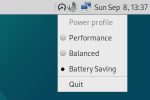
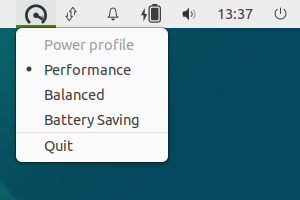

# powerprofilesctl-tray

Tray icon indicator for `powerprofilesctl` command (from [power-profiles-daemon](https://gitlab.freedesktop.org/upower/power-profiles-daemon) project) for laptop, with support of modern Ayatana Indicators.

This indicator is compatible with Debian 12 (*bookworm*), it combines well with [debian-mate-ayatana-settings](https://github.com/N0rbert/debian-mate-ayatana-settings). For standalone use one should install three packages - `power-profiles-daemon`, `gir1.2-ayatanaappindicator3-0.1` and `adwaita-icon-theme`:

```
sudo apt-get update
sudo apt-get install power-profiles-daemon gir1.2-ayatanaappindicator3-0.1 adwaita-icon-theme
```

Installation on the Debian 11 (*bullseye*) is possible too, but here user should download and install packages `power-profiles-daemon` and `adwaita-icon-theme` from Debian 12 (*bookworm*) repository manually. 

To install this indicator for the current user use the commands below:

```
cd ~/Downloads
git clone https://github.com/N0rbert/powerprofilesctl-tray
cd powerprofilesctl-tray

mkdir ~/bin
cp -v powerprofilesctl-tray.py ~/bin/
chmod +x ~/bin/powerprofilesctl-tray.py

mkdir -p ~/.config/autostart/

cat <<EOF > ~/.config/autostart/powerprofilesctl-tray.py.desktop
[Desktop Entry]
Type=Application
Exec=python3 $HOME/bin/powerprofilesctl-tray.py
Hidden=false
Name[en_US]=powerprofilesctl-tray
Name=powerprofilesctl-tray
Comment[en_US]=powerprofilesctl-tray
Comment=powerprofilesctl-tray
X-MATE-Autostart-Delay=0
EOF
```

The installed indicator will be placed inside MATE Panel as tray icon and will look as shown below:

| **Profile ↓** / **Look →** | **Default Debian with MATE desktop task** | **Debian with modern Ayatana Indicators using [debian-mate-ayatana-settings](https://github.com/N0rbert/debian-mate-ayatana-settings)** |
|:---------------------------:|:-----------------------------------------:|:---------------------------------------------------------------------------------------------------------------------------------------:|
| **Power-saver**             |  |  |
| **Balanced**                |     |     |
| **Performance**             |  |  |

Removal procedure is simple:

```
rm -v ~/.config/autostart/powerprofilesctl-tray.py.desktop
rm -v ~/bin/powerprofilesctl-tray.py
```

