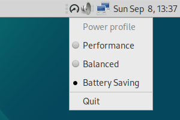
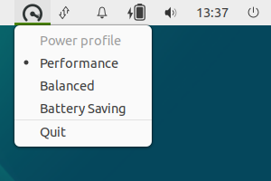

# powerprofilesctl-tray

Tray icon indicator for `powerprofilesctl` command (from [power-profiles-daemon](https://gitlab.freedesktop.org/upower/power-profiles-daemon) project) for laptop, with support of modern Ayatana Indicators.

This indicator is compatible with Debian 12 (*bookworm*), it combines well with [debian-mate-ayatana-settings](https://github.com/N0rbert/debian-mate-ayatana-settings). 

Depending on user needs, it may be packaged locally and then installed using below commands:

```
sudo apt-get update
sudo apt-get install debhelper git

cd ~/Downloads
git clone https://github.com/N0rbert/powerprofilesctl-tray
cd powerprofilesctl-tray
dpkg-buildpackage -uc -us -b
sudo apt-get install ../powerprofilesctl-tray*.deb
```

and then relogin or reboot and login to get indicator shown in the tray.

This script may be installed manually for single user by installing dependencies - `power-profiles-daemon`, `gir1.2-ayatanaappindicator3-0.1` and `adwaita-icon-theme`:

```
sudo apt-get update
sudo apt-get install power-profiles-daemon gir1.2-ayatanaappindicator3-0.1 adwaita-icon-theme
```

and then cloning this repository and copying needed files to the home folder by using commands below:

```
cd ~/Downloads
git clone https://github.com/N0rbert/powerprofilesctl-tray
cd powerprofilesctl-tray

mkdir ~/bin
cp -v usr/bin/powerprofilesctl-tray.py ~/bin/
chmod +x ~/bin/powerprofilesctl-tray.py

mkdir -p ~/.config/autostart/

cat <<EOF > ~/.config/autostart/powerprofilesctl-tray.py.desktop
[Desktop Entry]
Type=Application
Exec=python3 $HOME/bin/powerprofilesctl-tray.py
Name=powerprofilesctl-tray
Comment=Tray icon indicator for powerprofilesctl for laptop, with support of modern Ayatana Indicators
X-MATE-Autostart-Delay=0
EOF
```

and then relogin or reboot and login to get indicator shown in the tray.

The installed indicator will be placed inside MATE Panel as tray icon and will look as shown below:

| **Profile ↓** / **Look →** | **Default Debian with MATE desktop task** | **Debian with modern Ayatana Indicators using [debian-mate-ayatana-settings](https://github.com/N0rbert/debian-mate-ayatana-settings)** |
|:---------------------------:|:-----------------------------------------:|:---------------------------------------------------------------------------------------------------------------------------------------:|
| **Power-saver**             |  |  |
| **Balanced**                |     |     |
| **Performance**             |  |  |

Removal procedure is simple:

```
rm -v ~/.config/autostart/powerprofilesctl-tray.py.desktop
rm -v ~/bin/powerprofilesctl-tray.py
```

Note: installation on the Debian 11 (*bullseye*) is possible too, but here user should download and install packages `power-profiles-daemon` and `adwaita-icon-theme` from Debian 12 (*bookworm*) repository manually.
